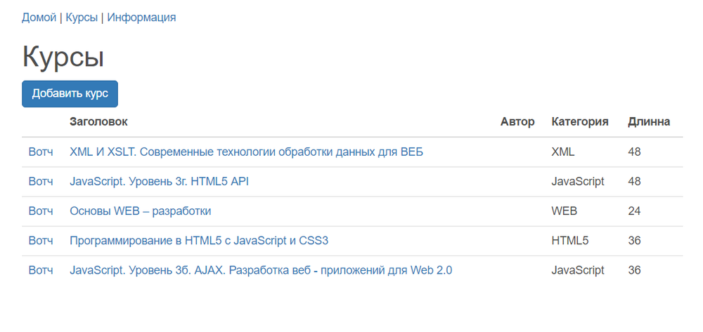
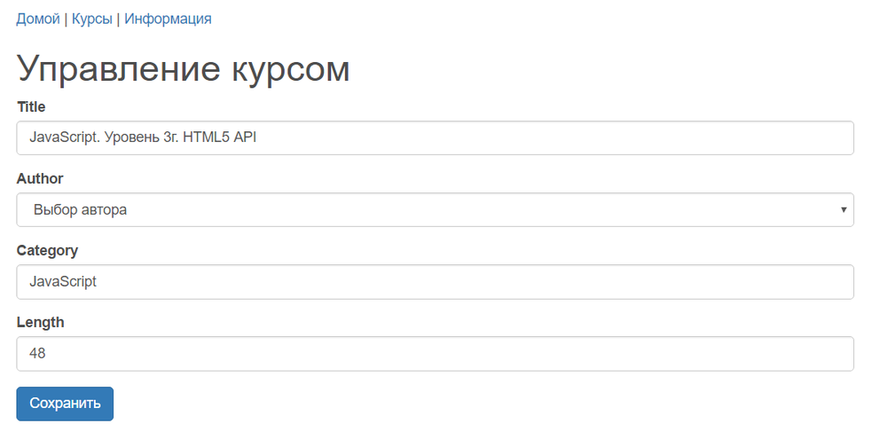
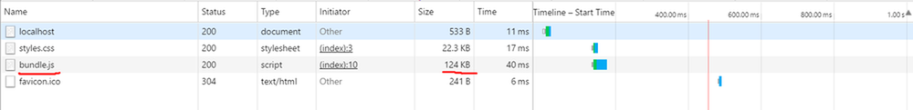

### Каталог курсов

  

 - **Обращение к api и отображение данных о курсах:**

 

 - **Редактирование и добавление новых курсов:**

  

 - **Сборка, для продакшена = 147KB:**

  

#### Приложение для разработки на реакте:
* react
* redux
* react-router
* es6

#### Основные возможности
* babel
* webpack
* eslint
* mocha
* express
* npm scripts

#### Установка и настройка
* git clone https://stasok@bitbucket.org/stasok/course-app.git - **скопируйте репозиторий к себе**
* cd course-app - **перейдите в папку с проектом**
* npm i  - **установите зависимости**
* npm start -s - **старт приложения в режиме разработки**
* npm run build - **сборка для продакшена, без горячей перезагрузки - минифицированная**

#### Получить помощь
https://bitbucket.org/stasok/course-app/pull-requests/ - принимаю пожелания и замечания.

#### Смотрите также
* [Лицензия](./LICENSE.md)
